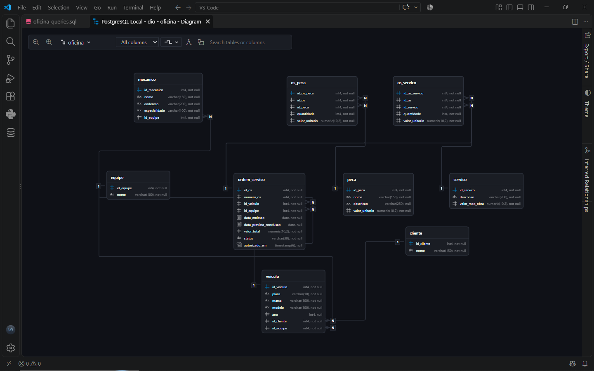

# Oficina Mecânica — PostgreSQL

Projeto de banco de dados PostgreSQL desenvolvido como desafio da DIO, simulando o gerenciamento de uma oficina mecânica.

## Objetivo

Criar um banco de dados relacional para registrar clientes, veículos, equipes, mecânicos, serviços, peças e ordens de serviço, além de realizar consultas SQL para análise das informações.

## Modelagem

Entidades:
- Cliente
- Veículo
- Equipe
- Mecânico
- Serviço
- Peça
- Ordem de Serviço
- OS Serviço
- OS Peça

## Modelo Relacional



### Principais relacionamentos

- Cliente → Veículo: 1:N
- Equipe → Mecânico: 1:N
- Equipe → Veículo: 1:N
- Equipe → Ordem de Serviço: 1:N
- Veículo → Ordem de Serviço: 1:N
- Ordem de Serviço ↔ Serviço: N:N
- Ordem de Serviço ↔ Peça: N:N

As relações N:N são implementadas pelas tabelas `os_servico` e `os_peca`.

## Banco de Dados

O projeto utiliza:
- PostgreSQL
- Chaves primárias (PK)
- Chaves estrangeiras (FK)
- Restrições `UNIQUE`
- Restrições `CHECK`
- Dados de exemplo para testes e consultas

## Consultas SQL

Foram desenvolvidas consultas utilizando:
- `SELECT`
- `WHERE`
- Atributos derivados
- `ORDER BY`
- `GROUP BY`
- `HAVING`
- `JOIN`
- `COUNT()`
- `SUM()`

As consultas respondem perguntas de negócio relacionadas a serviços, veículos, clientes e ordens de serviço.

## Estrutura do projeto

```text
dio-oficina-postgresql/
├── image/
│   └── oficina_schema.png
├── sql/
│   ├── oficina_tables.sql
│   ├── oficina_inserts.sql
│   └── oficina_queries.sql
└── README.md
```

## Tecnologias

- PostgreSQL
- SQL
- DBeaver
- GitHub

## Contexto

Projeto desenvolvido como parte dos desafios de banco de dados da DIO, com foco em modelagem relacional, implementação do esquema, persistência de dados e consultas SQL.

## Autor

Lúcio do Vale
